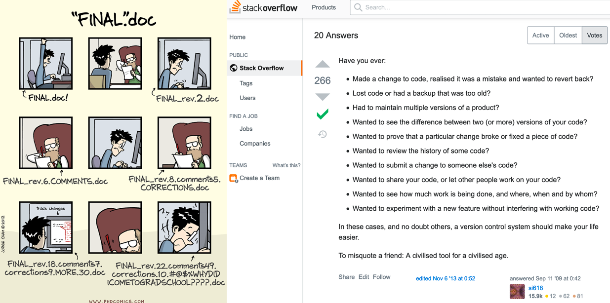
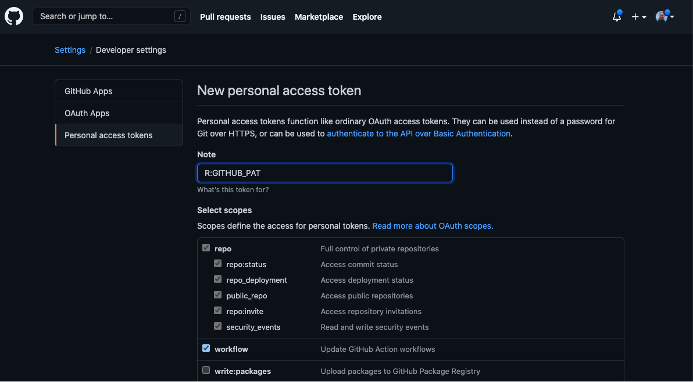
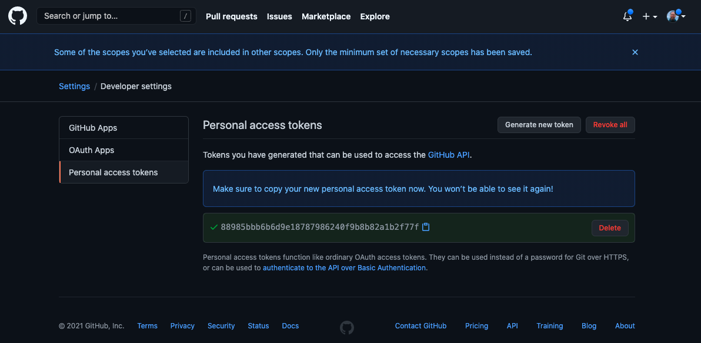
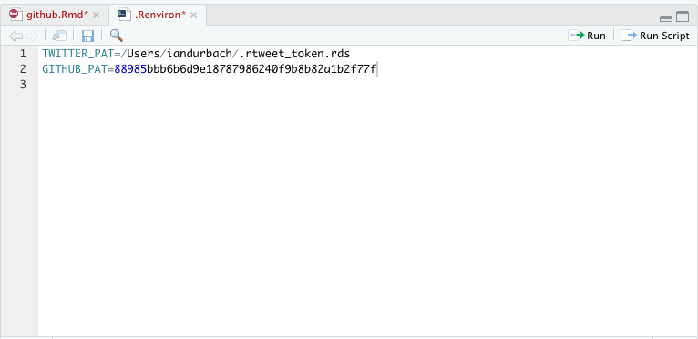
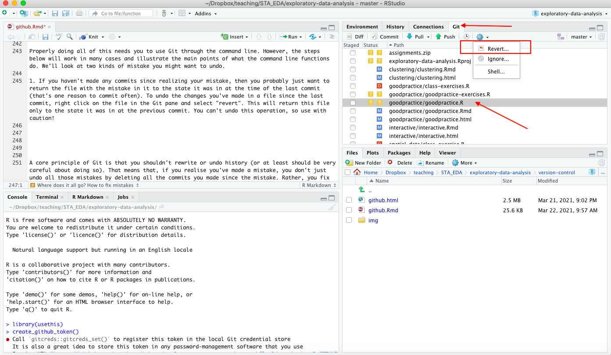
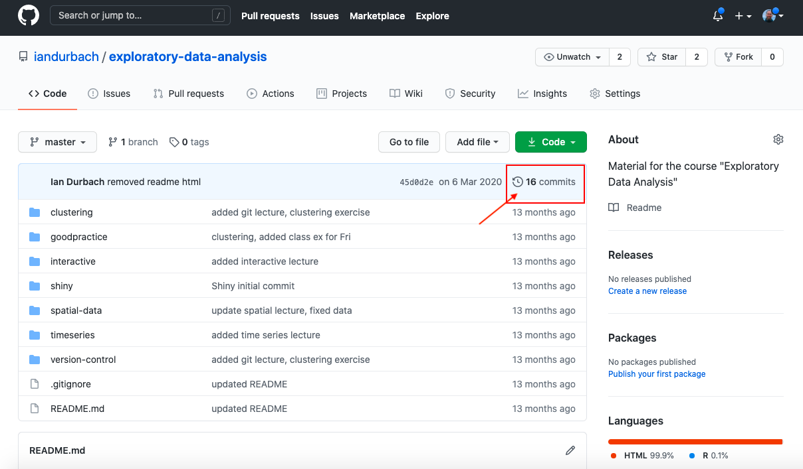
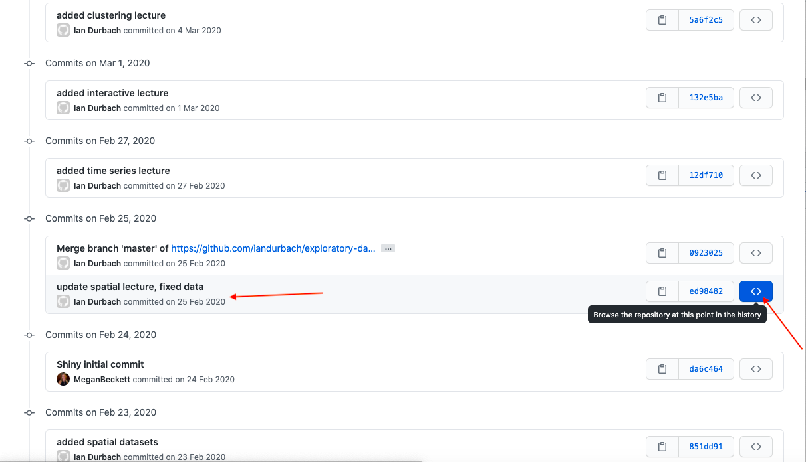
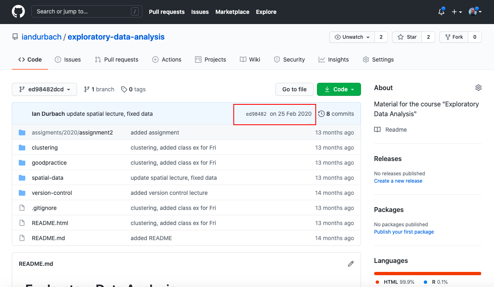
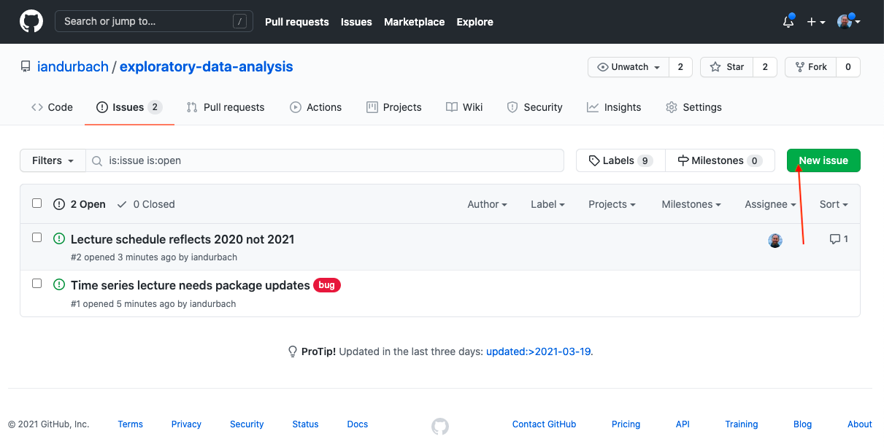

```{r setup, include=FALSE}
knitr::opts_chunk$set(echo = TRUE)
#knitr::opts_knit$set(root.dir = "")
```

# Git and GitHub

> The information in this section is a small part of Jenny Bryan's excellent [*Happy Git and GitHub for the userR*](http://happygitwithr.com/). More advanced material is [here](http://www-cs-students.stanford.edu/~blynn/gitmagic/).

## Getting started 

Git can do a lot of things, and this complexity can be overwhelming at first. I struggled (several times) to get a working understanding of version control with Git, so I've written this as the kind of very simple "how to" guide I would have liked to have had. If you already know how to use Git, or are more computer savvy than me, you might find it too elementary -- skip ahead as you see fit. 

Here are two things to keep in mind when getting started:

1. *Git*, *GitHub*, and a *Git client* go together. You need to know how to use them all (unless you plan on using the command line exclusively).
2. Most of what we'll do requires only the basics of Git. You can pick up the rest later.

Let's first look at how *Git*, *GitHub*, and a *Git client* fit together:

**Git**: Git is a version control system -- a way of keeping track of changes to a file over time (like "track changes" in Microsoft Word, for example). Originally used for source code, Git is now used by data scientists to track a set of files associated with a project over time. Git calls the set of files a *repository*, and it can contain data files, code, documents.

**GitHub**: Git is a program that lives on your computer. You could, if you wanted to, only ever use it locally to back-up your files. Most people though, use Git as a way to collaborate on projects, and share code and associated files. That needs some way of hosting Git-based projects on the internet, which is where *GitHub* comes in. GitHub is a web platform that hosts/stores Git-based projects. There are other hosting services out there, but we'll just focus on GitHub.

**Git client**: Git can either be run through the command line or using a helper application like a GUI that assists with the process. The helper application is called a client. Some users prefer the command line, and indeed there are some things that can only be done through the command line, but when getting started the use of a client can be a huge help. The good news is that RStudio comes with an inbuilt Git client, which is enough for most of our needs.

There are two "phases" to using R with GitHub:

1. *Setting up*. This involves installing Git, getting a GitHub account, connecting local Git with GitHub, and connecting RStudio with local Git. This can be a bit of a pain, but the good news is 
    + you only need to do this once,
    + I (or someone else) will provide help to get you set up, if needed.

2. *Working with GitHub*. This basically just involves remembering to do two things:
    + linking any new R projects to a GitHub repository
    + periodically saving your changes ("committing") and uploading these onto GitHub ("pushing")

We'll look at each of these in turn, but first a little bit about why you should almost certainly use Git and GitHub.

## Why version control? 

Quite simply, using version control software means that you have a bunch of snapshots of your code, data, and any associated files over time. The stackoverflow post below gives a lot of potential uses for these snapshots, but for most users, most of the time, the reason to use version control is that it means rarely, if ever, losing work -- if you find that you've made a mistake or lost your way, you can just go back to where you were before the mistake and continue.

```{r, echo=FALSE, out.width="900px"}

```

Why use version control with an online hosting service like GitHub? Here the answer is mainly so that you've got your work backed up, but it is also a convenient way to collaborate or share your work with others. "Your work" here doesn't just mean the most recent version of your work -- online hosting services keep the entire version-controlled history of your work so again, if you make a mistake *and* happen to lose your computer, you haven't actually lost any work.

## Setting everything up 

Getting set up involves a number of steps: installing Git, linking Git to GitHub, and linking both of these to R and RStudio. This is really difficult to do in class -- inevitably there will be one or two problems but it is impossible to know what these will be, and troubleshooting them will take up time. That said, this step is now a lot easier than it used to be, thanks largely to the **usethis** package. The steps here should work for most people that want to use Git and GitHub through RStudio, which is how we'll use it in this course (this is less restrictive than it might sound at first). These instructions are taken largely from those [here](https://kbroman.org/AdvData/18_rpack_demo.html),  [here](https://oliviergimenez.github.io/reproducible-science-workshop/), and [here]([here](https://inbo.github.io/git-course/course_rstudio.html#222_configuration).

1. Download and install [Git](https://git-scm.com/downloads).
2. Create a GitHub account, which you can do for free [here](https://github.com/).
3. Install R and RStudio (assumed done)

You then need to get Git, GitHub and RStudio talking to each other. First of all, tell RStudio where to find the Git installation, using steps 4-8.

4. Go to Tools > Global Options
5. Click on Git/SVN.
6. Check Enable version control interface for RStudio projects
7. Set the path to where the Git executable (`git.exe`) that you installed is. If you do not know where Git is installed, open your command line (cmd in Start for Windows user), type `where git` and hit enter. That should show the path.
8. Check use Git bash as shell for Git projects

The remainder of the setup steps use the **usethis** package, so make sure that this package is installed first.

9. Check that you do not have any Git accounts set up already (or later, check that you do) by entering 

```{r, eval = FALSE}
usethis::git_sitrep()
``` 

into the R console.

10. Use your github username and the email you used to sign-up on GitHub

```{r, eval = FALSE}
usethis::use_git_config(
    user.name = "iandurbach",
    user.email = "ian.durbach@uct.ac.za")
```

11. Create a GitHub Personal Authorisation Token. This will be used to verify your identity when you want to push and pull changes from your online repository to your local machine. 

```{r, eval = F}
usethis::create_github_token()
```

This will open up a browser, ask you to log in to your github account, and will open a form to create a github personal token (left hand plot below). Agree to the form and it will create a token like the one shown on the right hand side below. Copy this and don't share with anyone. (The one shown here is not my actual token; I deleted this one.)

```{r, echo=FALSE, out.width="450px"}


```

Then go back to RStudio and edit your `.Renviron` file so that it contains the token you just created.

```{r, eval = F}
usethis::edit_r_environ()
```

Add a line with `GITHUB_PAT=[your token]`, as in the figure below.
 
```{r, echo=FALSE, out.width="450px"}

```

You might need to restart R for the changes to take effect.

## Working with Git and GitHub through RStudio

In this section we'll set up an R Project and link it to a GitHub repo. That will make it easy to push changes we make in RStudio to GitHub, from within RStudio. First we'll introduce R Projects -- you can skip this if you are already familiar with these.

### A bit about R Projects

First introductions to R usually start by asking the new user to enter some commands at the command line,

```{r}
runif(5) + 3
```

This quickly becomes cumbersome: for one thing, you need to retype your commands each time you restart R. So people quickly move along to saving their commands in script files, which are basically text files containing a list of saved commands that R will recognise. This makes it easy to experiment in the console, figure out which code you want to keep, and save that code to the script file for later use. As a bonus, you can also run the whole script file at once by hitting Cmd/Ctrl + Shift + S, rather than having to run code line-by-line.

R Projects are a way to keep all files associated with a project in one place. Most people will do this themselves, in some way. For example, when I used to start a project, I would start a new folder with the name of the project, say `bank_fraud_detection`, then have a few subfolders with stuff I knew I would end up with: `past_papers`, `code`, `results`. Essentially, RStudio just provides support for this kind of structured process with its projects. Added bonuses (and the real reasons for using projects, rather than just organising the script files yourself) are:

* Easy integration with GitHub
* No need to set working directories (you only need relative paths)
* You can see any mess you've made while working in RStudio. This is a surprisingly powerful motivation to keep things neat and organised. 

Starting a project in RStudio is trivial, although it may take a little while to get used to using them, depending on how you work and how familiar with R you are.

From RStudio, select *File* then *New project*. For now, we'll just set up a basic project, with no GitHub integration, just to get started.

```{r, echo=FALSE, out.width="290px"}
knitr::include_graphics("img/proj1.png")
knitr::include_graphics("img/proj2.png")
knitr::include_graphics("img/proj3.png")
```

Any files you now save to this folder will be associated with the project. These can be files you create and save from R, or other files (e.g. data) that you copy into the folder independently of R.

You can find more information on [console-based](http://r4ds.had.co.nz/workflow-basics.html), [script-based](http://r4ds.had.co.nz/workflow-scripts.html), and [project-based](http://r4ds.had.co.nz/workflow-projects.html) workflows in R in Hadley Wickham and Garrett Grolemund's R4DS book.

### Make a new repository on GitHub 

1. Go to https://github.com, log in, find your way to "Repositories", and click the green "New" button.
2. Give your repo a name and description. 
3. Tick the box "Initialize this repository with a README"
4. Click "Create repository"
5. Click on the green "Clone or download" button and copy the URL in the box, which will be something like `https://github.com/iandurbach/myproject.git` (if you're using SSH, this is also where you can get the SSH key and passphrase).

### Start a new R project in RStudio, link it to GitHub

We've done this step before, but this time we're going to link the new project to GitHub (we're cloning an empty GitHub repository).

1. Start RStudio

2. Under File, choose New Project and then Version Control and finally Git

```{r, echo=FALSE, out.width="290px"}
knitr::include_graphics("img/gitproj1.png")
knitr::include_graphics("img/gitproj2.png")
knitr::include_graphics("img/gitproj3.png")
```

3. Paste the URL you copied from GitHub at the end of the previous step into the "Repository URL" box. You can always log back into GitHub and find this URL if you need to.

4. Give the project a directory name and choose where you want to create it. Think about where you want to create the project i.e. put it somewhere on your computer that makes sense, and that you won't want to change later on.

5. Tick the "Open in new session" box

6. Click "Create project"

If everything works you should now see a screen like the one below: a brand new R project, as before, but one that is also linked to the remote GitHub repository you set up previously. 

```{r, echo=FALSE, out.width="900px"}
knitr::include_graphics("img/gittedproj.png")
```

### Do something 

In this step you just "do something" you would usually do in R. For example:

1. Use your browser or file manager (e.g. Windows Explorer, Finder) to browse to the project folder you just created. In this folder, create two new folders, one called "data" and another called "output". 

2. Go back to RStudio and verify that the new folder and file has been detected.

3. Open a new script file (Cmd/Ctrl + Shift + N) and type the following code in it:

```{r, eval = FALSE}
library(ggplot2)

# create some data
x <- runif(100)
# save as RData file
save(x, file = "data/randomnumbers.RData")

# some workings
y <- 2*x 
mydata <- data.frame(y = y, x = x)
xyplot <- ggplot(mydata, aes(x = x, y = y)) + geom_point()
ggsave("output/xyplot.png", xyplot, width = 7, height = 6, dpi = 200)
```

4. Save the script file as "first-commit.R". Run the script file. Verify that both the script file, the data, and the output plot are saved in the project directory.

### Commit the changes you just made

Commiting saves changes locally -- like taking a snapshot of your files at a particular point in time. 

1. In RStudio, click the "Git" tab. 

```{r, echo=FALSE, out.width="900px"}
knitr::include_graphics("img/commit.png")
```

2. Choose the files you want to commit by ticking the "Staged" box (for those you want to commit). Particularly early on, think about what you do and don't want to commit and push. Its advised to push source code that creates data and plots, rather than the data and plots themselves. Also, the way we are using GitHub, everything you push is publicly available, so you may not want to put your data or brilliant new idea up for all to see and use (repos can also be made private). Note though, that you can commit and push any file -- data, figures, as well as code.

3. Click "Commit", which will open up a new pane. Here you'll be able to see any changes to existing files that you'll be committing. For now all the files are new, so there's nothing to see. For each commit, you need to add a "Commit message" in the text box provided. For now, type "first commit" or similar, and then click "Commit". 

Your changes are now committed.

### Push your local commits to GitHub 

Pushing saves your changes on the remote repository. You'd always commit first, before pushing, so these steps start off at the end of a commit step, just after you click "Commit".

1. Click the blue "Pull" tab. This checks that there is not a more recent copy of your files on GitHub. If you're working on your own this will obviously be the case, but if you are collaborating someone may have pushed their changes since you last pulled, and this can create conflicts. Pull-before-push is therefore a useful habit to get into. You should get a message saying "Already up-to-date". Close this window.

2. Click the green "Push" tab. This will push your changes onto the GitHub repo. Once complete, you can close the window and the main pane you have been using. Go to your repo on GitHub, refresh the browser, and check that the changes have been uploaded. 

### Where does it all go? How to fix mistakes

The steps above -- making some changes to your code, data, etc; committing those changes locally; and pushing those changes to your GitHub repository -- give you a way of maintaining a full history of your project, from start to finish. Each commit that you make is a snapshot of your project files at that point in time. That means that if you make a mistake and want to go back to a previous version of some or all of your project files, you just need to find the stage in your commit history that you want to return to. 

Properly doing all of this needs you to use Git through the command line. However, the steps below will work in many cases and illustrate the main points of what the command line functions do. We'll look at two kinds of mistake you might want to undo.

1. If you haven't made any commits since realizing your mistake, then you probably just want to return the file with the mistake in it to the state it was in at the time of the last commit (that's one reason to commit often). To undo the changes you've made in a file since the last commit, right click on the file in the Git pane and select "revert". This will return this file only to the state it was in at the previous commit. You can't undo this operation, so use with caution!

```{r, echo=FALSE, out.width="900px"}

```

2. If you have made several commits since the mistake, things are a bit trickier. A core principle of Git is that you shouldn't rewrite or undo history (or at least should be very careful about doing so). That means that, if you realise you've made a mistake, you don't just undo all those mistakes by deleting all the commits you made since the mistake. Rather, you fix the mistake by finding the version of the file immediately before the mistake, and then make **another commit** that replaces the erroneous file with the corrected version. 

First, you'll need to find the last working version of the file -- the file you want to return to. To do this, we'll view the commit history on GitHub (you can do it locally, but it's a bit trickier). Go to the repository, and click on the clock-type icon indicated in the red box below.

```{r, echo=FALSE, out.width="900px"}

```

That will bring up all of the commits that you've made. You'll now need to do a bit of detective work to find the commit that contains the file in the mistake-free state you want. The easiest way to do this is to use the commit messages to try and find roughly where you think the mistake happened, and then browse the repository around that point in time. Say you think the mistake happened just after commit labelled "Update spatial lecture, fixed data". Then browse the files as they looked like at that commit by clicking on the `<>` button indicated in red. 

```{r, echo=FALSE, out.width="900px"}

```

That will take you to the familiar view of the repository, except this is what the repository looked like when you made that commit. You can browse any of the files in the repository as normal, so you can go to the file and check that it is what you want to revert to. 

```{r, echo=FALSE, out.width="900px"}

```

You can then just copy the code in this file back into your R project, and make a new commit that overwrites the version of the file with the error in it with this old, but clean, version. This approach is a bit hacky, but it gets the job done without using the command line. Note that this completely replaces the code in whatever file you are changing, so you will also lose any intermediate changes you made between those commits. So you should make sure that you're only fixing the mistake, not also removing a bunch of good work that you've done since that point in time. But since you're making an additional commit, nothing is lost forever. If you realise that there was actually something valuable you overwrote, you can repeat the steps above to retrieve it.

The steps above are as far as we'll go in this course, and are enough to get you up and running with using Git and GitHub through RStudio. For those that are interested in knowing more, I've included a separate document in the course repository on working with Git through the command line, without a Git client. 

## GitHub issues

Each repository comes with an "Issues" tab. This can be used in the same way as a forum, to raise questions and issues related to the material in the repository, and to plan, record and discuss tasks. For the course repository, it would be a good place to ask questions about code that doesn't work, topics you would like clarified, etc. In most repositories issues will be largely related to the code in the repo, but we can be more relaxed about the issues for the course repository -- use it to ask any questions you like. Raising a new issue is pretty straightforward, just click on "New issue" and go from there. You can also contribute to an existing issue by selecting that issue, scrolling down, and leaving a comment. See [here](https://guides.github.com/features/issues/) for more information on issues.

```{r, echo=FALSE, out.width="900px"}

```

## Collaborating with others on GitHub

This section assumes there is an existing GitHub repo that you would like to interact with, by using the code in the repo and/or by contributing code to the repo yourself. These steps will also work in *starting* a collaborative project -- you'll just start by forking an empty repo (belonging to the person you're collaborating with).  

1. Fork the target repo to your own GitHub account. Do this by browsing to the target repo on GitHub and clicking the "Fork" button. This creates your own copy of the repo.
2. You can now clone the repo to your local machine. From *your* GitHub account, get the repo's URL by clicking the "Clone or download" button as before.
3. Start a new R project using version control as shown before (*File > New Project > Version Control > Git*). Enter the URL you copied in the previous step. You should see the contents of the target repo in your R project.
4. You can now work on the project and commit and push any changes in exactly the same way described previously. If you're not interested in developments in the target repo, or in collaborating by contributing changes to the target repo, then you don't need the following steps. Often though, you will want to keep your forked repo up-to-date with the target repo (either to keep track of new developments or because you are working together in some way). In that case, read on.
5. To keep a forked repo up-to-date with the target repo, you first need to configure a remote that points from your repo to the "upstream" target repo. First check the current remote repository for your fork by opening the terminal, browsing to the project directory and typing `git remote -v`. You should see the URL of your repo.
6. Add the upstream target repo by typing `git remote add upstream https://github.com/ORIGINAL_OWNER/ORIGINAL_REPOSITORY.git`. Type `git remote -v` again to check that it has been added.
7. You can now pull any updates from the target repo into your local repo (fork) with `git pull upstream master`.

If you are going to be contributing changes to the target repo, you should now create a new branch and do your work there, rather than working directly in the master branch. When you are ready to push your changes upstream to the target repo, you do this by opening a pull request:

1. Browse to the main page of the target repo.
2. In the "Branch" menu, choose the branch that contains your commits.
3. Click "New pull request".
4. Choose the branch of the target repo you want to merge your changes with.
5. Enter a title and description for your pull request.
6. Click "Create pull request".

The pull request is then sent to the owner of the target repo, who may accept the request, ask for additional changes, or reject the request. 

### Sources and further resources

1. http://happygitwithr.com/ 
2. http://www-cs-students.stanford.edu/~blynn/gitmagic/
3. https://www.atlassian.com/git/tutorials/resetting-checking-out-and-reverting
4. https://github.com/blog/2019-how-to-undo-almost-anything-with-git
5. https://guides.github.com/activities/forking/
6. https://help.github.com/articles/fork-a-repo/
7. https://help.github.com/articles/configuring-a-remote-for-a-fork/
8. https://help.github.com/articles/syncing-a-fork/
9. https://www.youtube.com/watch?v=u-kAeG4jkMA
